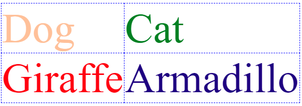

= HTML Quiz 1

Given the following HTML file with no stylesheet:

[source,html]
----
<!doctype html>
<html lang="en">
<head>
<title>Nothing</title>

</head>
<body>
<table>
<tr><td class="c1">Dog</td><td class="c2">Cat</td></tr>
<tr><td class="c3">Giraffe</td><td class="c4">Armadillo</td></tr>
<tr></tr>
</table>
</body>
</html>
----

add code to the stylesheet to get the following result:

TIP: The font size is 64 points

